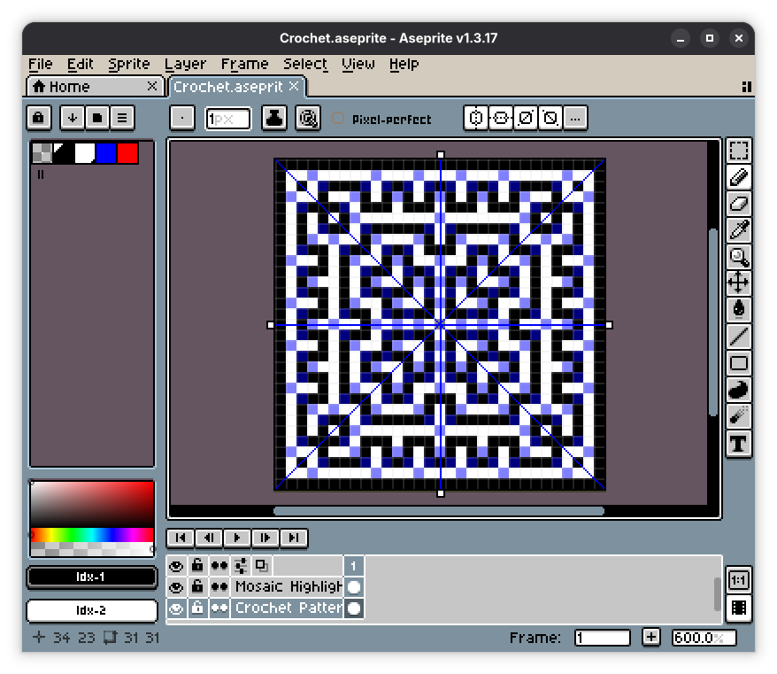

# Inset Mosaic Crochet Helper for Aseprite

This Aseprite plugin provides real-time highlights for overlay stitches and invalid overlay placements for inset mosaic crochet patterns.

Companion to the [Mosaic Crochet Web editor](https://github.com/lechaosx/mosaic-crochet-editor) — a standalone browser-based version of the same tool.

<table>
<tr>
<td></td>
<td></td>
</tr>
</table>

```
Round 1: ([sc, ch] × 4)
Round 2: [(sc, ch, sc), oc] × 4
Round 3: [(sc, ch, sc), oc, sc, oc] × 4
Round 4: [(sc, ch, sc), oc, [sc, oc] × 2] × 4
Round 5: [(sc, ch, sc), oc, [sc, oc] × 3] × 4
Round 6: [(sc, ch, sc), oc, [sc × 3, oc] × 2] × 4
Round 7: [(sc, ch, sc), [oc, sc] × 2, sc × 3, [sc, oc] × 2] × 4
Round 8: [(sc, ch, sc), oc, [sc × 3, oc] × 3] × 4
Round 9: [(sc, ch, sc), oc, sc × 4, [sc, oc] × 2, sc × 5, oc] × 4
Round 10: [(sc, ch, sc), oc, [sc × 7, oc] × 2] × 4
Round 11: [(sc, ch, sc), oc, sc × 17, oc] × 4
Round 12: [(sc, ch, sc), sc, [sc, oc, sc × 2] × 5] × 4
Round 13: [(sc, ch, sc), oc, sc × 2, [sc, oc] × 8, sc × 3, oc] × 4
Round 14: [(sc, ch, sc), oc, sc × 2, [sc × 3, oc] × 4, sc × 5, oc] × 4
Round 15: [(sc, ch, sc), sc × 27] × 4
```

## Features

- **Row Mode:** Supports standard row-by-row mosaic patterns.
- **Round Mode:** Supports rectangular patterns worked in rounds from the outside in, with Full, Half, and Quarter sub-modes for symmetric designs.
- **Real-time Highlighting:** Automatically updates a "Mosaic Highlights" layer as you draw on the "Crochet Pattern" layer.
- **Validation:**
  - Highlights valid overlay stitch locations in blue.
  - Highlights invalid overlay placements in red.
- **Export:** Exports the finished pattern as human-readable stitch notation to a `.txt` file.
- **Automatic Setup:** Creates a pre-configured sprite with the correct layers, palette, and properties.

## Installation

1. Download the source zip from the [latest release](../../releases/latest).
2. In Aseprite, go to **Edit > Preferences > Extensions**.
3. Click **Add Extension** and select the downloaded zip.

## Usage

### Creating a New Pattern

1. Go to **File > New Mosaic Crochet Sprite**.
2. Choose a **Mode**: `row` or `round`.
   - For **Row** mode, specify the width and height.
   - For **Round** mode:
     - Choose a **Sub-mode**: Full, Half, or Quarter.
       - **Full:** draws the complete virtual space (all four sides).
       - **Half:** draws the bottom half only; fold the finished piece along the inner hole boundary.
       - **Quarter:** draws the bottom-left quarter only; fold along both inner hole boundaries.
     - Specify the **Inner Width** and **Inner Height** of the unworked hole at the center.
     - Specify the number of **Rounds**.
3. Click **OK**.

### Drawing

- Draw on the **Crochet Pattern** layer using the first two palette colors (Color A and Color B).
- The plugin automatically maintains the **Mosaic Highlights** layer:
  - **Blue pixels** indicate where an overlay stitch should be placed.
  - **Red pixels** indicate an invalid placement that violates inset mosaic crochet rules.
- Any non-pattern colors are automatically snapped to the nearest of Color A or Color B.

### Exporting

1. Once the pattern has no red highlights, go to **File > Export > Export Crochet Pattern**.
2. Choose a save path and optionally enable **Alternate Direction** to reverse every even row/round (for back-and-forth working).
3. Click **Export**.

The output uses standard stitch abbreviations:
- `sc` — single crochet (worked in pattern color)
- `oc` — overlay crochet (worked in contrast color one row/round below)
- `ch` — chain (at round corners)
- `(sc oc)` — two stitches worked into the same parent stitch (increase)
- `sc × 6` — repeated stitch; `[sc, oc] × 4` — repeated group

#### Limitations

The exported pattern is intentially technique-agnostic and covers the stitch sequence only. The following must be handled manually:

- **Foundation** — Depending on shape of your pattern, you can either start into magic ring, foundation chain or directly as foundation sc.
- **Row and round ends** — For row mode, you can use COM technique. For round mode, invisible join followed by chain should be sufficient.
- **No inner hole** - If your pattern has no inner hole, the innermost round is emitted as `(ch × 4)` — replace this with 4 sc worked into a magic ring.

## Technical Details

- **Layers:**
  - `Crochet Pattern`: The main layer where you design your pattern.
  - `Mosaic Highlights`: An overlay layer created and managed by the plugin.
- **Palette:**
  - Index 0: Transparent
  - Index 1: Color A (default black)
  - Index 2: Color B (default white)
  - Index 3: Blue (valid overlay highlight)
  - Index 4: Red (invalid placement highlight)
- **Sprite Properties:** The plugin stores configuration in custom sprite properties (`mosaicMode`, `rounds`, `virtualWidth`, `virtualHeight`, `virtualOffsetX`, `virtualOffsetY`).

## License

This project is licensed under the MIT License - see the [LICENSE.md](LICENCE.md) for details.

## Changelog

See [CHANGELOG.md](CHANGELOG.md) for a full history of changes.
